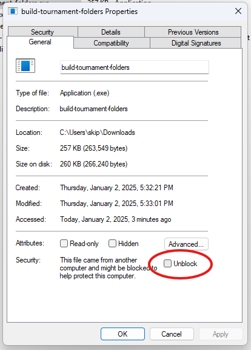

Note that many computers will block execution of exe files downloaded from the internet (very understandably). However, we need to be able to run the exe files included with this program. This is a two-step process. First, you have to convince your browser that this is something that you want to do. Each browser is different, but I have screenshots below for MS Edge. Once you have downloaded the file, you then you have to convince Windows that you really want to run the file.

Step one. Convince your browser that you want to download the file.

Once you the file downloaded and moved to where you want it, you then have to convince Windows you want to run it. In windows, to UNBLOCK an exe file, you simply have to right-click on the file, choose "Properties", and then check the "Unblock" setting.

